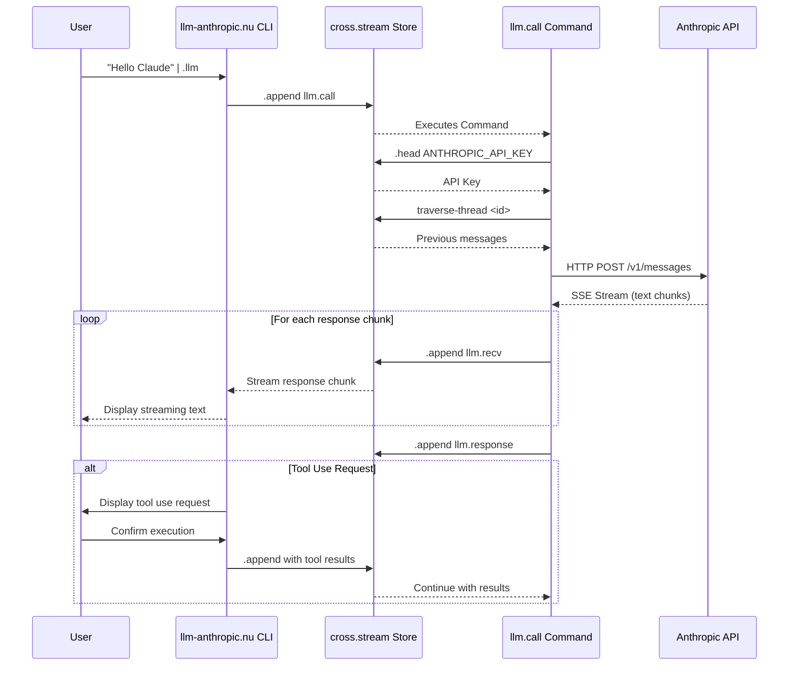

## Onboarding

```nushell
overlay use ./llm
help llm
```


## Features

- rich documents(??)
- prompt caching (to be fleshed out) TODO: make document caching optional

Todo:

- docstrings for the exported commands

```nushell
help llm
```

- llm init-store: prepares a cross stream store for use with this tool

```
key | .append ANTHROPIC_API_KEY
cat xs-command-llm-anthropic.nu | .append llm.define
"hi" | .append llm.call
```

- llm run llm.call independent of a store

```
let c = source xs-command-llm.call-anthropic.nu ; do $c.process ("hi" | .append go)
```

- Working with the response

```
.cat | where topic == "llm.response" | last | .cas | from json
```

Adhoc request: translate the current clipboard to english

```
[
    (bp)               # our current clipboard: but really you want to "pin" a
                       # snippet of content
    "please translate to english"  # tool selection
]
# we should be able to pipe a list of strings directly into llm.call
| str join "\n\n---\n\n"
| (.append
    -c 03dg9w21nbjwon13m0iu6ek0a # the context which has llm.define and is generally considered adhoc
    llm.call
    )
```

View outstanding calls:

```
.cat | where topic in ["llm.call" "llm.error" "llm.response"] | reduce --fold {} {|frame acc|
     if $frame.topic == "llm.call" {
       return ($acc | insert $frame.id "pending")
     }

     $acc | upsert $frame.meta.frame_id ($frame | reject meta)

   }
```



## Why Use This Approach

The cross.stream framework offers significant advantages over traditional AI
integration approaches:

### Event-Sourced Architecture

This system stores all interactions as a linked chain of events, creating
powerful capabilities:

- **Streaming Responses:** Any UI (terminal, web, desktop) can subscribe to see
  Claude's responses as they arrive
- **Temporal Navigation:** Browse conversation history at any point, fork
  discussions from previous messages
- **Resilience:** Interrupted responses retain all partial data
- **Asynchronous Processing:** LLM calls run independently in the background,
  managed by the cross.stream process

### Command-Based Integration

By registering `llm.call` as a cross.stream command:

- Operations run independently of client processes
- State is managed through the event stream rather than memory
- Multiple consumers can observe the same operation
- Persistence is maintained across client restarts

### Terminal-Native Workflow

- Seamlessly integrates with developer command-line workflows
- Leverages Nushell's powerful data manipulation capabilities
- Creates composable pipelines between AI outputs and other tools
- Provides a foundation for custom tooling built around LLM interactions

This approach creates a clean separation between API mechanisms and clients,
making it easier to build specialized interfaces while maintaining a centralized
conversation store.
