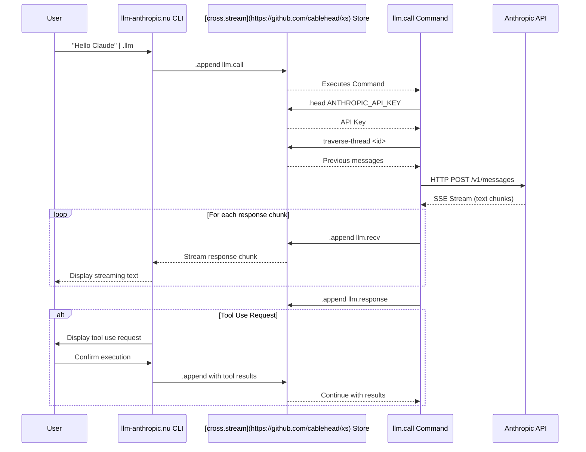

# xs-command-llm-anthropic

A [cross.stream](https://github.com/cablehead/xs)
[command](https://cablehead.github.io/xs/reference/commands/) and Nushell
module for interacting with Anthropic's Claude AI models. This add-on leverages
cross.stream's event-sourced architecture to provide persistent, stateful
conversations with Claude that can be integrated into your terminal workflow.


## Requirements

- [cross.stream](https://github.com/cablehead/xs)
- [anthropic-text-editor](https://github.com/cablehead/anthropic-text-editor) (for the --with-tools option):
  A micro-CLI to apply tool calls from Anthropic for their [text_editor_20250124](https://docs.anthropic.com/en/docs/agents-and-tools/computer-use)
  built-in computer use tool

## Onboarding

Quick start with the `llm` module:

1. **Load the module overlay**:

```nushell
overlay use -p ./llm
help llm
```

2. **Initialize your API key and register the [cross.stream](https://github.com/cablehead/xs) [command](https://cablehead.github.io/xs/reference/commands/)**:

```nushell
$env.ANTHROPIC_API_KEY | llm init-store
```

3. **Make a test call**:

```nushell
llm call
```

```
Enter prompt: hola
Text:
¡Hola! ¿En qué puedo ayudarte hoy?
```

You're ready to go!

## Features

- An interactive harness for processing [Claude's built-in `bash_20250124` and
  `text_editor_20250124`
  tools](https://docs.anthropic.com/en/docs/agents-and-tools/computer-use)
- Rich documents, e.g. pdfs
- Prompt caching for rich documents (to be fleshed out) TODO: make document caching optional: enable caching for all content types

## To document

- document how to run llm.call without registering it

```
let c = source xs-command-llm.call-anthropic.nu ; do $c.process ("hi" | .append go)
```

- Working with the response

```
.head llm.response | .cas | from json
```

Adhoc request: translate the current clipboard to english

```
[
    (bp)               # our current clipboard: but really you want to "pin" a
                       # snippet of content
    "please translate to english"  # tool selection
]
# we should be able to pipe a list of strings directly into llm.call
| str join "\n\n---\n\n"
| (.append
    -c 03dg9w21nbjwon13m0iu6ek0a # the context which has llm.define and is generally considered adhoc
    llm.call
    )
```

View outstanding calls:

```
.cat | where topic in ["llm.call" "llm.error" "llm.response"] | reduce --fold {} {|frame acc|
     if $frame.topic == "llm.call" {
       return ($acc | insert $frame.id "pending")
     }

     $acc | upsert $frame.meta.frame_id ($frame | reject meta)

   }
```

## Reference



## Why Use This Approach

The [cross.stream](https://github.com/cablehead/xs) framework offers significant advantages over traditional AI
integration approaches:

### Event-Sourced Architecture

This system stores all interactions as a linked chain of events, creating
powerful capabilities:

- **Streaming Responses:** Any UI (terminal, web, desktop) can subscribe to see
  Claude's responses as they arrive
- **Temporal Navigation:** Browse conversation history at any point, fork
  discussions from previous messages
- **Resilience:** Interrupted responses retain all partial data
- **Asynchronous Processing:** LLM calls run independently in the background,
  managed by the [cross.stream](https://github.com/cablehead/xs) process

### Command-Based Integration

By registering `llm.call` as a [cross.stream command](https://cablehead.github.io/xs/reference/commands/):

- Operations run independently of client processes
- State is managed through the event stream rather than memory
- Multiple consumers can observe the same operation
- Persistence is maintained across client restarts

### Terminal-Native Workflow

- Seamlessly integrates with developer command-line workflows
- Leverages Nushell's powerful data manipulation capabilities
- Creates composable pipelines between AI outputs and other tools
- Provides a foundation for custom tooling built around LLM interactions

This approach creates a clean separation between API mechanisms and clients,
making it easier to build specialized interfaces while maintaining a centralized
conversation store.
